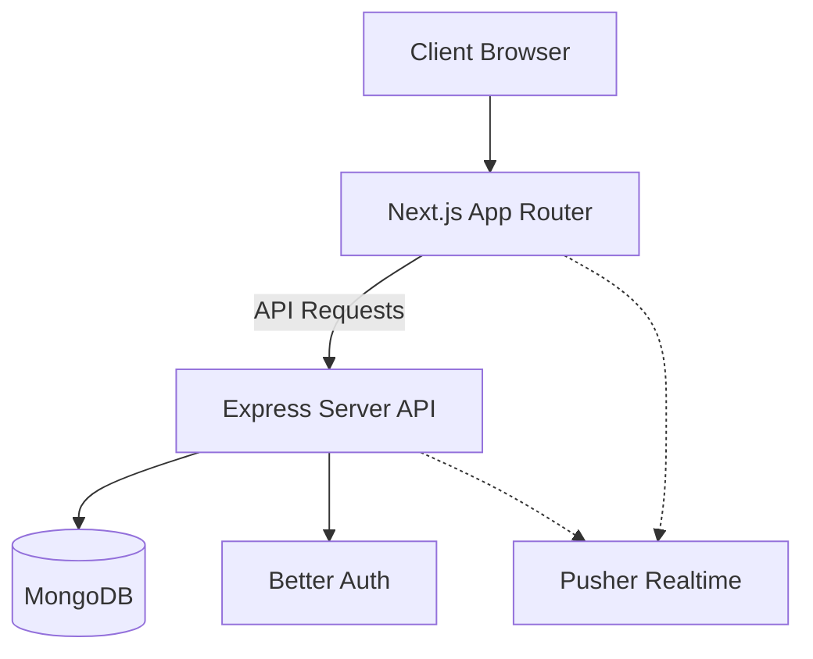

<div align="center">
  <h1>🚀 ServiceHub Client</h1>
  <p><b>The gorgeous frontend interface of the ServiceHub local-service-booking marketplace.</b></p>
  <p><i>Because finding a trustworthy plumber shouldn't be harder than fixing the pipe yourself! 🛠️</i></p>
  
  
  
  
  
</div>

---

## 🔗 Links & Demo Credentials
Why read documentation when you can just click things? Test drive the platform!

- 🌍 **Live Website:** [Click Here to be Amazed](https://service-hub-client-tawny.vercel.app)
- 💻 **Frontend Repo:** [ServiceHub-client](https://github.com/Md-Nur-A-Alam/ServiceHub-client)
- 🗄️ **Backend Repo:** [ServiceHub-server](https://github.com/Md-Nur-A-Alam/ServiceHub-server)

> **🔑 Magic Keys (Demo Customer)**  
> **Email:** `customer@gmail.com`  
> **Password:** `Customer@123`

---

## 🌟 Top Features & Highlights
We didn't just build a CRUD app; we built an *experience*. Here are the core modules that make ServiceHub shine:

<details>
<summary><b>🎭 Triple-Role Architecture (Guest, Customer, Provider, Admin)</b></summary>
<p>
The platform intelligently adapts its UI based on who is logged in. Providers get powerful service management and scheduling tools, customers get streamlined booking and history tracking, and admins get an eagle-eye view of the entire platform's cash flow and user activity.
</p>
</details>

<details>
<summary><b>⚡ Real-Time Booking Engine</b></summary>
<p>
Nobody likes mashing F5. When a customer requests a booking, the provider gets a real-time notification. When the provider accepts, the customer's dashboard updates instantly. It feels alive.
</p>
</details>

<details>
<summary><b>💳 Seamless Stripe Integration</b></summary>
<p>
Frictionless payment flows. We handle Stripe Elements natively so users never feel like they are leaving the platform when they hand over their hard-earned cash.
</p>
</details>

<details>
<summary><b>🌓 True Dynamic Theming</b></summary>
<p>
Not just "invert the colors." We built a robust, Material-3-inspired custom DaisyUI theme that perfectly balances contrast, primary (Indigo), secondary (Amber), and tertiary (Emerald) hues across both Light and Dark modes.
</p>
</details>

---

## 🧠 Engineering Marvels (How We Solved the TRICKY Stuff)

Building this wasn't all sunshine and rainbows. Here are the complex issues we encountered and how we engineered our way out of them:

> **🛑 The Problem: State Synchronization Chaos**
> *With multiple users interacting simultaneously, how do we ensure a user doesn't double-book a time slot or view stale data?*
> 
> **✅ The Solution: The React Query + Pusher Wombo-Combo**
> We strictly separated "Client State" from "Server State". We use **Zustand** strictly for UI state (is a modal open? what theme is active?). For data, we use **React Query**. We wired **Pusher JS** WebSockets directly into React Query's cache. When a Pusher event arrives (e.g., `booking-updated`), we don't manually mutate state—we simply invalidate the specific React Query key, forcing a lightning-fast background refetch that updates the UI seamlessly without a full page reload.

> **🛑 The Problem: Form Re-render Hell**
> *Forms with multiple image uploads, nested complex validation, and rich text were causing the app to crawl during keystrokes.*
>
> **✅ The Solution: Uncontrolled Zod Forms**
> We bypassed standard React controlled inputs by utilizing **React Hook Form** paired with **Zod** resolvers. Inputs remain uncontrolled until submission or validation, dropping re-renders by over 80%. We achieved strict type-safety from the schema down to the input props.

---

## 📸 The Glamour Shots (Visual Tour)

<details>
<summary><b>🛒 Service & Payment Flow (Where the magic happens)</b></summary>
<br>

</details>

<details>
<summary><b>👑 The Admin Panopticon (Analytics Galore!)</b></summary>
<br>

</details>

<details>
<summary><b>💼 Provider Command Center</b></summary>
<br>

</details>

<details>
<summary><b>👀 Customer Hub</b></summary>
<br>

</details>

<details>
<summary><b>🔔 Live Notifications & Service Lists</b></summary>
<br>

</details>

<details>
<summary><b>⭐ Trust Engine (Review Flow)</b></summary>
<br>

</details>

---

## 🛠️ The "Under the Hood" Tech Stack

| Category | Weapon of Choice | Why we chose it |
| :--- | :--- | :--- |
| **Framework** | Next.js 16.2 | Because we love App Router and face-melting SSR speed. 🏎️ |
| **Language** | TypeScript | To catch our typos before production does. 🐛 |
| **Styling** | Tailwind CSS v4 & DaisyUI | Utility-first flexbox wizardry. 🧙‍♂️ |
| **State / Data** | React Query & Zustand | Server state & client state holding hands peacefully. 🤝 |
| **Forms / Val.** | React Hook Form & Zod | Uncontrolled inputs + flawless validation schemas. 🛡️ |
| **Auth** | Better Auth | Because rolling your own auth is a certified trap. 🪤 |
| **Charts** | Recharts | Making data look sexy for the C-Suite (Admins). 📈 |
| **Realtime** | Pusher JS | "Ping!" - Instant WebSocket magic. 🪄 |

---

## 🏗️ Architecture Visualization



---

## 📂 Interactive Folder Structure

<details>
<summary><b>🗺️ Unroll the map of <code>src/</code></b></summary>

```text
src/
├── app/              # 🚦 Next.js App Router pages (the real MVPs, grouped by (admin), (auth), etc.)
├── components/       # 🧩 Reusable UI LEGO blocks
├── data/             # 🗃️ Constants, mock data, and static configs
├── hooks/            # 🪝 Custom React hooks keeping logic DRY
├── lib/              # 🛠️ Utility functions, fetch wrappers (the duct tape)
├── store/            # 📦 Zustand state slices 
└── types/            # 🏷️ TypeScript definitions ensuring we play by the rules
```
</details>

---

## 🚀 Run It Yourself (Ignition Sequence)

<details>
<summary><b>⚙️ Step-by-Step Installation</b></summary>

1. **Clone it (make it yours):**
   ```bash
   git clone https://github.com/Md-Nur-A-Alam/ServiceHub-client.git
   cd service-hub-client
   ```

2. **Install the magic dependencies:**
   ```bash
   npm install
   ```

3. **Environment Variables (The Secret Sauce):**
   Copy `.env.example` to `.env.local` and feed it:

   | Variable | Example | What is it? |
   | :--- | :--- | :--- |
   | `MONGODB_URI` | `mongodb://localhost:27017/ServiceHub` | Where the data sleeps |
   | `BETTER_AUTH_SECRET` | `yoursecretkeyhere` | Shhh 🤫 |
   | `SERVER_URL` | `http://localhost:8000` | The backend |
   | `NEXT_PUBLIC_SERVER_URL` | `http://localhost:8000` | What the browser sees |

4. **Fire it up!** (Make sure your backend is running too!)
   ```bash
   npm run dev
   ```
   *Boom.* You're live at `http://localhost:3000`.
</details>

---

## 📜 License & Author

Distributed under the ISC License. Because sharing is caring.

<br>

<div align="center">
  
  <br/>
  <h3>Built with ❤️ and excessive caffeine by Nur</h3>
  <a href="https://github.com/Md-Nur-A-Alam">GitHub</a> • <a href="https://www.linkedin.com/in/md-nur-a-alam13">LinkedIn</a>
</div>
