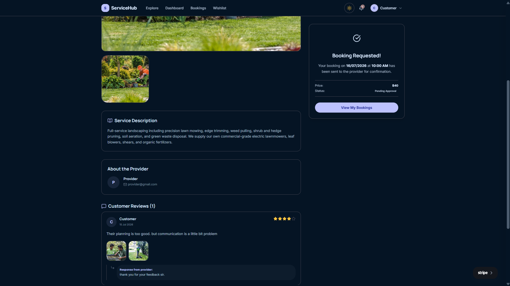
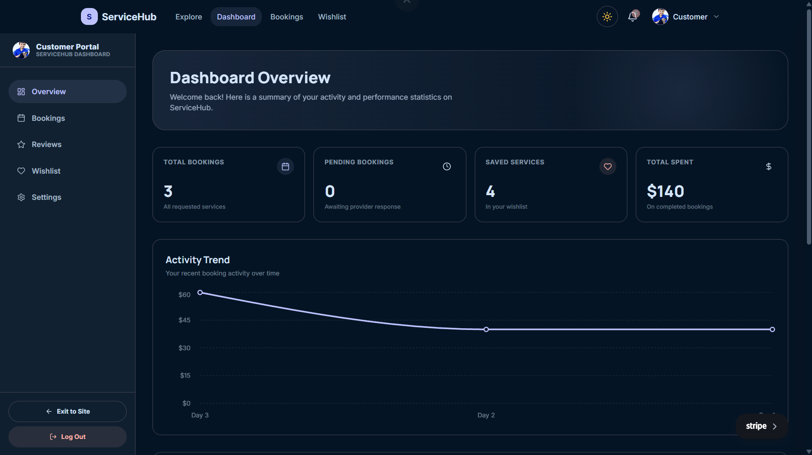
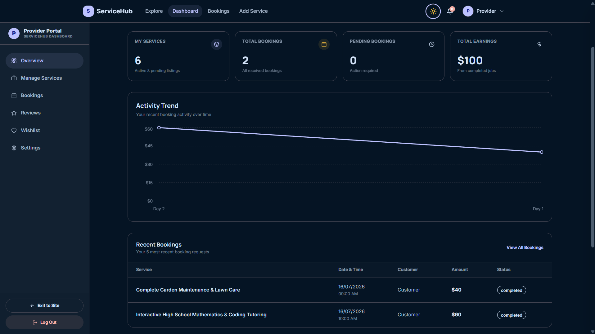
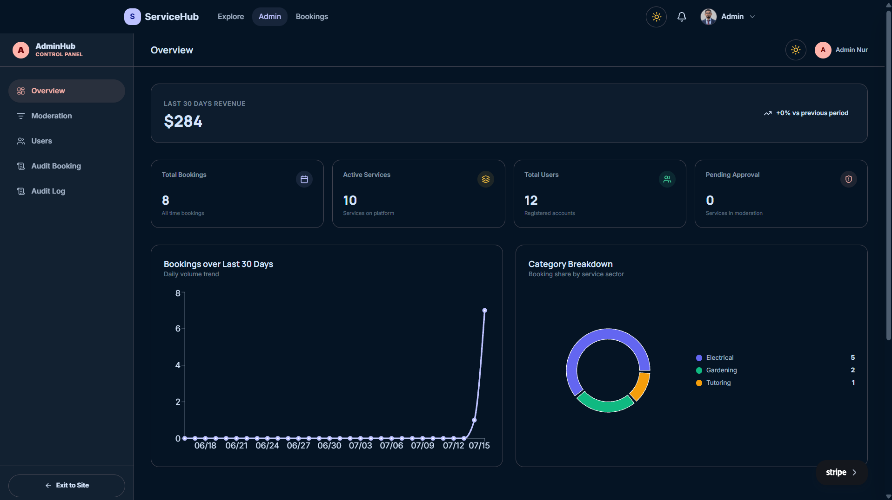
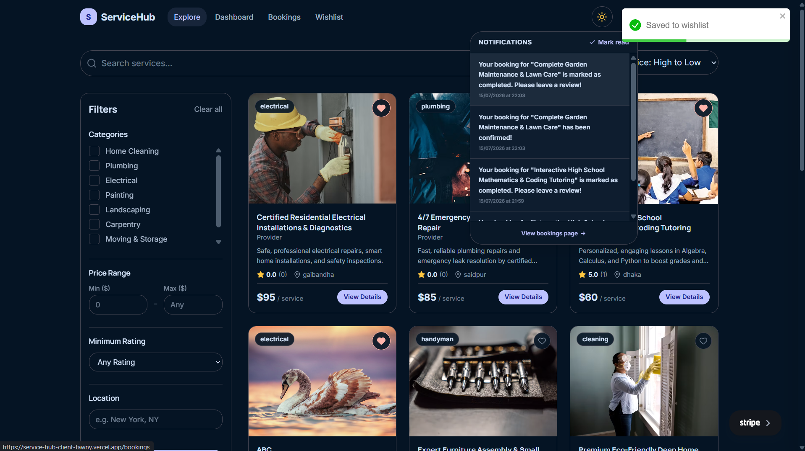
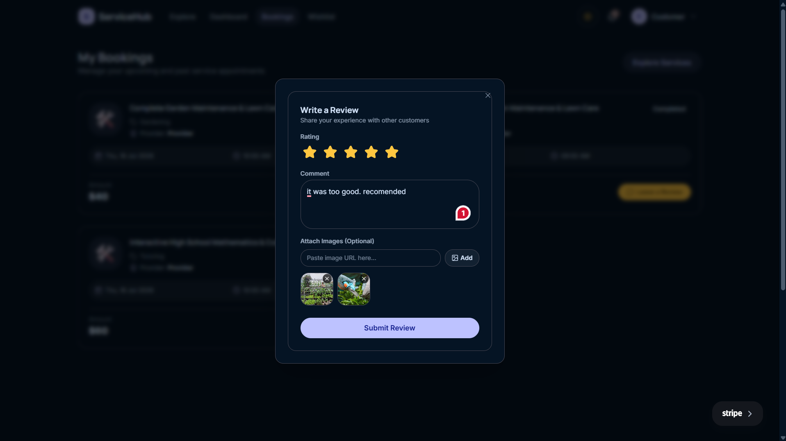
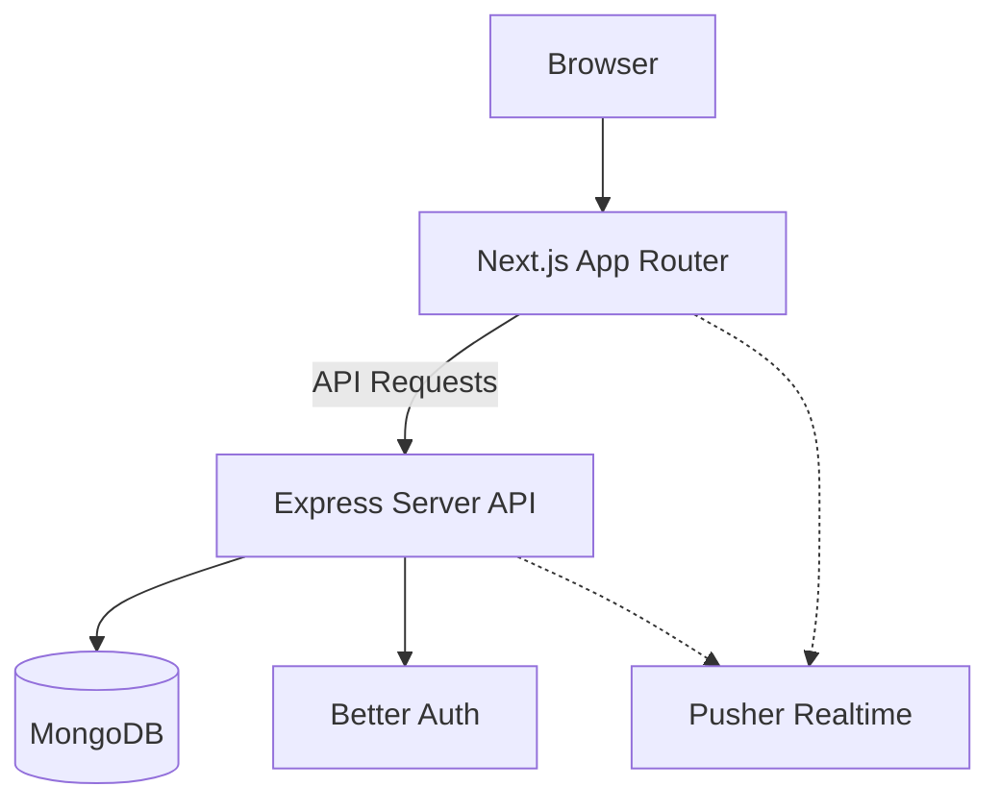

# ServiceHub Client

> A full-stack TypeScript local-service-booking marketplace.


## Links & Demo Credentials

- **Live Website:** [ServiceHub](https://service-hub-client-tawny.vercel.app)
- **Frontend Repository:** [ServiceHub-client](https://github.com/Md-Nur-A-Alam/ServiceHub-client)
- **Backend Repository:** [ServiceHub-server](https://github.com/Md-Nur-A-Alam/ServiceHub-server)

### Demo Credentials (Customer)
- **Email:** `customer@gmail.com`
- **Password:** `Customer@123`

## Screenshots

### Service & Payment Flow


### Dashboards




### Features



## Overview
ServiceHub is a comprehensive marketplace connecting customers with local service providers. It offers a seamless platform for discovering services, scheduling appointments, and processing payments securely. The platform caters to three main user roles: Customers (who book services), Providers (who offer services and manage their listings), and Admins (who oversee platform operations).

Notable implementation details include realtime booking status updates using Pusher, robust role-based access control leveraging Better Auth, and a highly polished, dual light/dark Material-3-derived design system built with Tailwind CSS and DaisyUI.

## Table of Contents
- [Overview](#overview)
- [Key Features](#key-features)
- [Tech Stack](#tech-stack)
- [Architecture](#architecture)
- [Folder Structure](#folder-structure)
- [Design System](#design-system)
- [Getting Started](#getting-started)
- [Available Scripts](#available-scripts)
- [Routes and Pages](#routes-and-pages)
- [Deployment](#deployment)
- [Contributing](#contributing)
- [License & Author](#license--author)

## Key Features

**Guest / Public**
- Browse and search for local services.
- View service details, provider profiles, and reviews.

**Customer**
- Create an account and manage profile details.
- Book services and choose available time slots.
- Process secure payments via Stripe integration.
- Track booking status in real-time.
- Leave reviews and ratings for completed services.

**Provider**
- Manage service listings (create, edit, delete).
- View and manage incoming booking requests (accept, reject, complete).
- Realtime notifications for new bookings and status changes.

**Admin**
- Oversee all users (customers and providers).
- Monitor platform activity and resolve disputes.

## Tech Stack

| Category | Technology | Purpose |
| :--- | :--- | :--- |
| **Framework** | Next.js 16.2 | React framework utilizing App Router for SSR and CSR. |
| **Language** | TypeScript | Static typing for improved developer experience and safety. |
| **Styling** | Tailwind CSS v4 & DaisyUI | Utility-first CSS and pre-built accessible components. |
| **State / Data** | React Query & Zustand | Server state synchronization and client-side global state. |
| **Forms / Validation** | React Hook Form & Zod | Efficient form state management and schema-based validation. |
| **Authentication** | Better Auth | Comprehensive authentication and role-based access control. |
| **Charts** | Recharts | Composable charting library for admin and provider dashboards. |
| **Realtime** | Pusher JS | WebSocket client for realtime booking updates. |
| **Animations** | Framer Motion | Declarative animations for UI elements. |

## Architecture

The client application communicates with a separate Express API server.



## Folder Structure

```text
src/
├── app/              # Next.js App Router pages and layouts
├── components/       # Reusable UI components
├── data/             # Static data, constants, or mock data
├── hooks/            # Custom React hooks (e.g., useAuth, useBookings)
├── lib/              # Utility functions and library configurations
├── store/            # Zustand state management stores
└── types/            # TypeScript interfaces and type definitions
```

## Design System

The application uses a custom DaisyUI theme configured in `src/app/globals.css`. Theming is driven entirely by CSS custom properties supporting dynamic light and dark modes via `next-themes`. The design philosophy incorporates a Material-3-derived token system, defining surfaces, primary (Indigo), secondary (Amber), and tertiary (Emerald) colors, along with strict typography and rounded radius tokens.

## Getting Started

### Prerequisites
- Node.js (v20 or higher)
- npm or yarn

### Installation

1. Clone the repository:
   ```bash
   git clone https://github.com/yourusername/service-hub-client.git
   cd service-hub-client
   ```

2. Install dependencies:
   ```bash
   npm install
   ```

3. Set up environment variables:
   Copy `.env.example` to `.env.local` and configure the values.

### Environment Variables

| Variable | Description | Required | Example |
| :--- | :--- | :--- | :--- |
| `MONGODB_URI` | MongoDB connection string (used if Better Auth runs locally) | Yes | `mongodb://localhost:27017/ServiceHub` |
| `DB_NAME` | Database name | Yes | `ServiceHub_DB` |
| `BETTER_AUTH_SECRET` | Secret key for Better Auth sessions | Yes | `yoursecretkeyhere` |
| `BETTER_AUTH_URL` | Base URL for authentication | Yes | `http://localhost:3000` |
| `SERVER_URL` | Express API server URL (Server-side) | Yes | `http://localhost:8000` |
| `CLIENT_URL` | Client application URL | Yes | `http://localhost:3000` |
| `GOOGLE_CLIENT_ID` | Google OAuth Client ID | No | `googleclientid` |
| `GOOGLE_SECRET_ID` | Google OAuth Secret ID | No | `googlesecretid` |
| `NEXT_PUBLIC_SERVER_URL` | Public-facing URL for the Express server | Yes | `http://localhost:8000` |

### Running the Application

To run the application locally, you must also start the `service-hub-server` concurrently. Ensure `NEXT_PUBLIC_SERVER_URL` points to the running server instance.

```bash
npm run dev
```
The client will be available at `http://localhost:3000`.

## Available Scripts

| Script | Description |
| :--- | :--- |
| `npm run dev` | Starts the Next.js development server. |
| `npm run build` | Builds the application for production. |
| `npm run start` | Starts the production server. |
| `npm run lint` | Runs ESLint to catch and fix code issues. |

## Routes and Pages

| Route Group | Access | Description |
| :--- | :--- | :--- |
| `(public)` | Public | Landing page, service listings, public profiles. |
| `(auth)` | Public | Login, registration, password reset flows. |
| `(customer)` | Customer | Customer dashboard, booking history, profile management. |
| `(provider)` | Provider | Provider dashboard, service management, schedule overview. |
| `(admin)` | Admin | Platform analytics, user management, global settings. |

## Deployment

The application is optimized for deployment on Vercel. Ensure all environment variables are correctly configured in your deployment platform settings. 

Build Command: `npm run build`

## Contributing

1. Fork the Project
2. Create your Feature Branch (`git checkout -b feature/AmazingFeature`)
3. Commit your Changes (`git commit -m 'Add some AmazingFeature'`)
4. Push to the Branch (`git push origin feature/AmazingFeature`)
5. Open a Pull Request

## License & Author

Distributed under the ISC License. 


**Author:** Nur  
**GitHub:** [GitHub Profile](https://github.com/)  
**LinkedIn:** [LinkedIn Profile](https://linkedin.com/)
